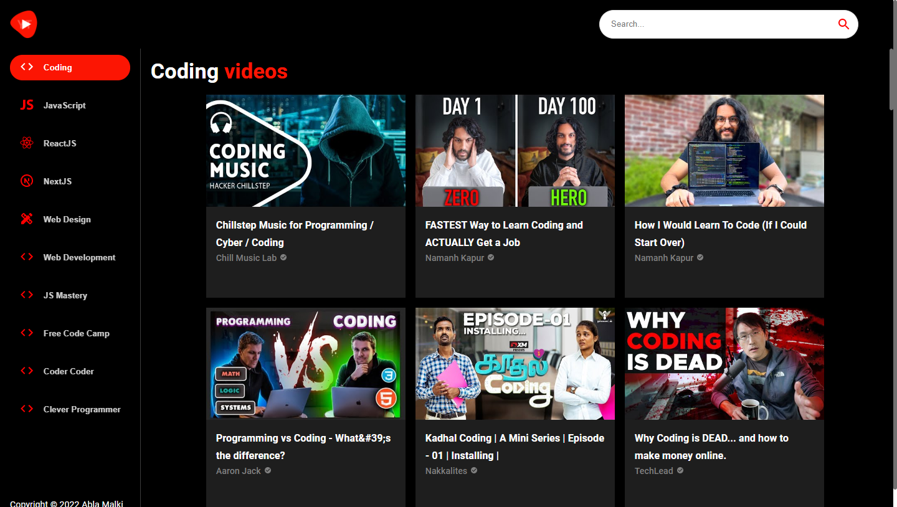

<h1 align="center">
  CodeTube
</h1>
 

 

  CodeTube is a Modern and personal YouTube Clone Application, It includes links to my favorite YouTube coding and dev channels ,the CodeTube app combines the industry's most advanced JavaScript tools including React.js, Material UI,

 
<h1 align="center">
  Tech stack
</h1>
 

  Inside the CodeTube app, I worked with the most modern, and in-demand technologies in the JavaScript ecosystem, such as React.js, Material UI, Rapid API, and more!
   

  
  
 A JavaScript library for building   user interfaces 

  
   
  
 A React UI tools that help to   ship new features faster. 

    

